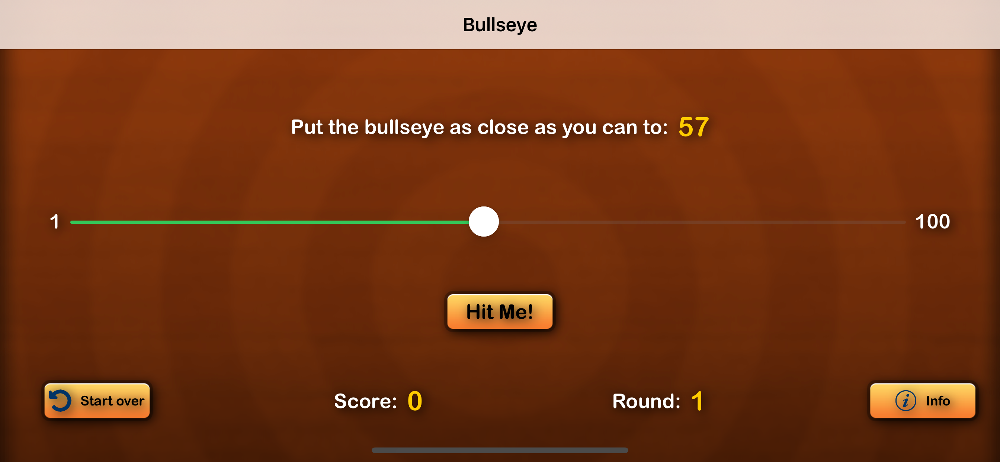
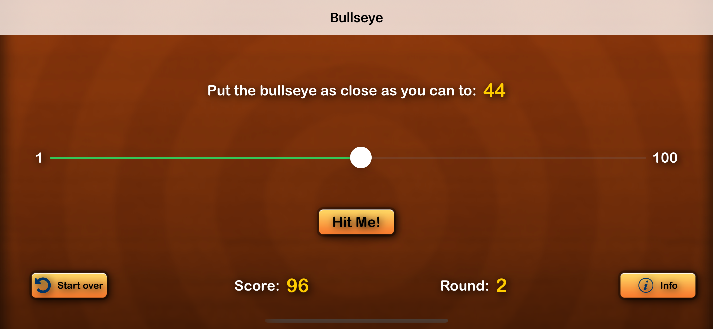

# iOS App Using SwiftUI
Built this project while watching the Ray Wenderlich tutorials.

## What did you learn? 

You'll start by learning the basics of SwiftUI, a new way for iOS developers to build user interfaces for their apps using Swift. Then, you’ll master app fundamentals like strings, variables, and app state. You’ll even learn how to fix bugs! You’ll get a primer in coding basics to level-up your app-development skills. You’ll add more cool functionality to your game and practice your new coding skills.

Finally, you’ll amp up the flair by learning how to style your app!

## Post Implementation

## Reference -
https://www.raywenderlich.com/4919757-your-first-ios-and-swiftui-app
